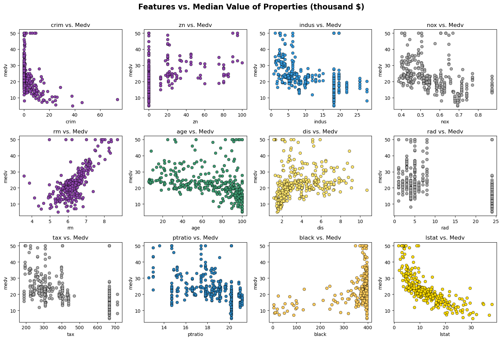
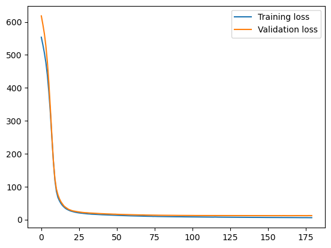
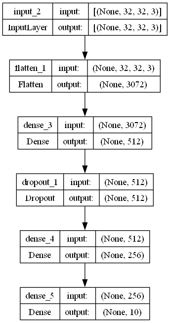
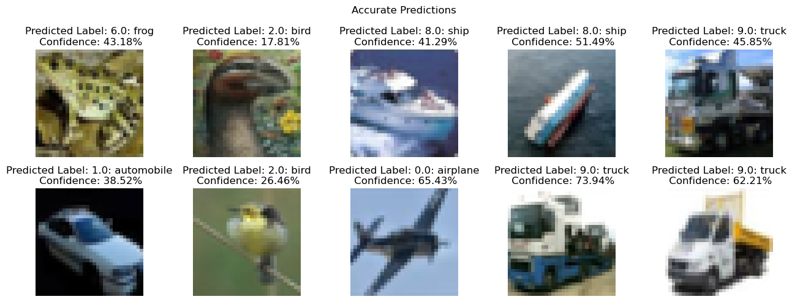
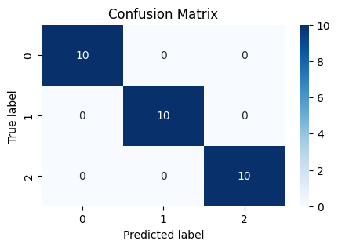
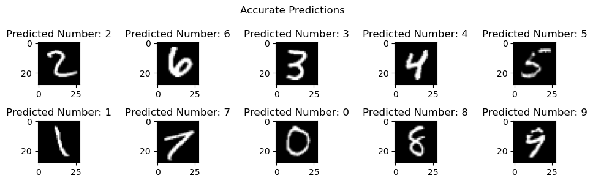
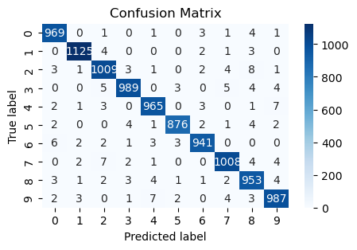
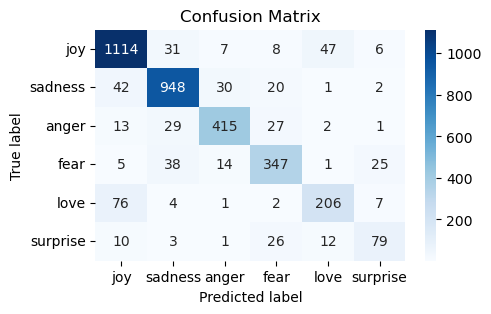
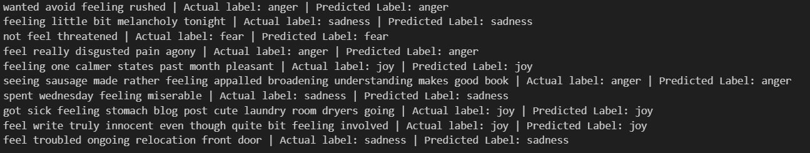

# Building MLP Neural Networks with TensorFlow

This repository chronicles my journey into exploring both the low-level and high-level capabilities of TensorFlow/Keras. It serves as a practical implementation hub for building artificial neural networks, specifically Multilayer Perceptrons (MLPs), across various datasets.

## About the Project

The foundation of my learning stems from the book [*TensorFlow in Action* by Thushan Ganegedara](https://www.amazon.com/TensorFlow-2-0-Action-Thushan-Ganegedara/dp/1617298344). This excellent resource, along with the detailed [TensorFlow documentation](https://www.tensorflow.org/), guided me through the pain-points of Eager Tensors, `tf.function`, and GradientTape.

This repository includes implementations of MLP architectures for a variety of datasets, including:
- MNIST
- Iris
- Mercedes Benz Greener Manufacturing
- Boston Housing
- CIFAR-10
- Text classification task - Emotion Detection

Some models were built from scratch using the low-level Keras API, while others utilized higher-level APIs like `Model` or `Sequential`. These examples demonstrate how to adapt MLP architectures to handle different types of data, including images, tabular data, and text.

---

## Getting Started

### Prerequisites

For GPU support on Windows, I recommend using [Anaconda](https://www.anaconda.com/) and installing TensorFlow version 2.10.1.  

### Installation

1. Clone the repository:
   ```bash
   git clone https://github.com/danieltar18/linear-algebra.git

2. Install the required dependencies:
   ```
   pip install tensorflow==2.10.1
   ```
3. Launch Jupyter Notebook or VS code:

## Project Highlights

### Boston Housing

For the Boston Housing dataset, I implemented a custom MLP class with multiple hidden layers using ReLU activations. Hyperparameter tuning was performed using KFold cross-validation and grid search.  

Before passing the data to the neural network, I applied a `Normalization` layer to preprocess the features.  

**Model Performance:**
- Validation RMSE: **3.45**
- Validation MAE: **2.59**

The optimal model architecture included 2 hidden layers with 32 and 16 neurons, and a learning rate of 0.001.

**Feature Scatter Plot:**


**Training Loss:**

<p align="center">
  
</p>

Dataset source: [Kaggle - Boston Housing](https://www.kaggle.com/c/boston-housing)

---

### CIFAR-10

For the CIFAR-10 dataset, I explored TensorFlow's capabilities for handling image data, following the best practices outlined in [this tutorial](https://www.tensorflow.org/tutorials/load_data/images).  

Although CNNs are typically more effective for image recognition tasks, I experimented with MLPs to understand their performance in this context. The optimal model architecture had 2 hidden layers with dropout (rate = 0.2) and a learning rate of 0.0001.

**Model Performance:**
- Accuracy (Stratified KFold, 5 splits): **38-39%**

**Model Architecture Visualization:**

<p align="center">
  
</p>

**Predictions with Confidence:**


Dataset source: [Kaggle - CIFAR-10](https://www.kaggle.com/competitions/cifar-10)

---

### Iris

The Iris dataset was used to demonstrate low-level TensorFlow/Keras functionality, including the use of `tf.function`, `GradientTape`, and manual forward passes with gradient computations.

**Model Performance:**
- Accuracy (Stratified KFold, 5 splits): **~100%**

**Confusion Matrix:**

<p align="center">
  
</p>

Dataset source: [UCI Machine Learning Repository - Iris](https://archive.ics.uci.edu/dataset/53/iris)

---

### Mercedes Benz Greener Manufacturing

This project focused on predicting manufacturing times using a dataset provided by Mercedes Benz. The data consists of a dense matrix with boolean features.

**Model Performance:**
- R² Score: **0.52771**

Dataset source: [Kaggle - Mercedes Benz Greener Manufacturing](https://www.kaggle.com/competitions/mercedes-benz-greener-manufacturing)

---

### MNIST

The MNIST dataset, a classic benchmark for image recognition tasks, was used to train an MLP model. A low-level TensorFlow implementation with 1 hidden layer (784 neurons) achieved impressive results.

**Model Performance:**
- Accuracy (Stratified KFold, 5 splits): **98.3%**

**Accurate Predictions:**


**Confusion Matrix:**

<p align="center">
  
</p>


Dataset source: [Yann LeCun's MNIST Database](http://yann.lecun.com/exdb/mnist/)

---

### Text Classification - Emotions

For text classification, I used the Emotions dataset to detect emotions in text data. An embedding layer was built following TensorFlow's [word embeddings guide](https://www.tensorflow.org/text/guide/word_embeddings).

- Accuracy (Stratified KFold, 5 splits): **~87%**

**Confusion Matrix:**

<p align="center">
  
</p>


**Some Accurate Predictions:**

<p align="center">
  
</p>


Dataset source: [Kaggle - Emotions Dataset for NLP](https://www.kaggle.com/datasets/praveengovi/emotions-dataset-for-nlp?select=val.txt)

---

## Conclusion

This repository shows how MLPs can be used for a variety of data types. While architectures like CNNs and RNNs may perform better for specific tasks, working with MLPs is a great way to learn about neural network design and implementation.

Feel free to explore the projects and adapt the code for your own datasets. Contributions and suggestions are welcome!

Next Repository will be CNN-s!:)
